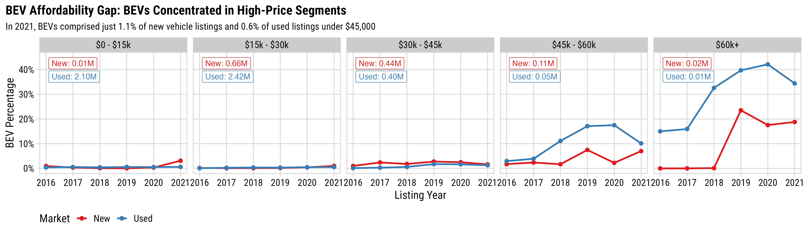
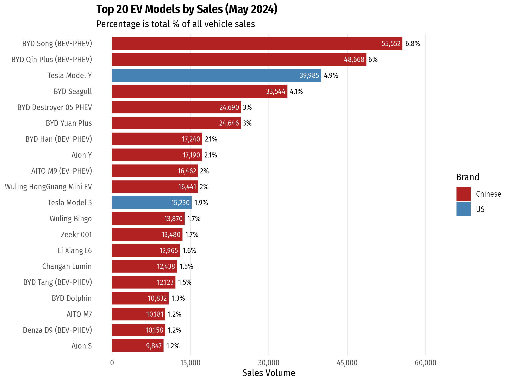

```{r setup, include=FALSE}
library(knitr)
library(fontawesome)
library(metathis)

options(
    htmltools.dir.version = FALSE,
    knitr.table.format = "html",
    knitr.kable.NA = '',
    dplyr.width = Inf,
    width = 250
)
knitr::opts_chunk$set(
    warning = FALSE,
    message = FALSE,
    fig.path = "figs/",
    fig.width = 7.252,
    fig.height = 4,
    comment = "#>",
    fig.retina = 3
)

# Setup xaringanExtra options
xaringanExtra::use_xaringan_extra(c(
  "tile_view", "panelset", "share_again"))
xaringanExtra::style_share_again(share_buttons = "none")
xaringanExtra::use_extra_styles(
  hover_code_line = TRUE,
  mute_unhighlighted_code = FALSE
)

# Set up website metadata
meta() %>%
  meta_general(
    description = rmarkdown::metadata$subtitle,
    generator = "xaringan and remark.js"
  ) %>%
  meta_name("github-repo" = "jhelvy/slides") %>%
  meta_social(
    title = rmarkdown::metadata$title,
    url = "https://slides.jhelvy.com",
    og_type = "website",
    og_author = "John Paul Helveston",
    twitter_card_type = "summary_large_image",
    twitter_creator = "@johnhelveston"
  )
```

background-image: url("images/blue.jpg")
background-size: cover
class: inverse

<br><br><br><br>

## `r rmarkdown::metadata$title`

**.white[John Paul Helveston]**, George Washington University

`r rmarkdown::metadata$date`

---

background-color: #fff

<center>

</center>

---

class: center
background-color: #fff

.leftcol70[

<center>

</center>

.font70[Source: https://www.iea.org/reports/global-ev-outlook-2024/executive-summary]

]

.rightcol30[

### The EV sector has an affordability problem<br>(except in China)

]

---

class: center
background-color: #fff

## There are _very_ few affordable BEVs in the US

<center>

</center>

Data pulled from >60k dealerships, 2016 to 2021. Source: marketcheck.com

---

class: center
background-color: #fff

# The US has affordable EV deserts

<center>

</center>

---

# Things that don't help affordability:

<br>

--

## **Tariffs** (100% tariff on imported Chinese EVs)

--

## Effectively banning the use of Chinese suppliers (inc. raw materials) in US EVs

---

## **Opportunities**

.leftcol[

## Chinese FDI into U.S.

### **Gotion batteries**: Multi-billion dollar investments in Illinois and Michigan

### Challenge: Uncertainty around Foreign Entities of Concern (FEOC) status

]

--

.rightcol[

## Technology Licensing Agreements

### **Ford-CATL**: Licensing battery technology in a Michigan plant

### Challenge: CATL was recently added to DOD's list of “Chinese military companies”

]

---

class: middle, center, inverse

# We need to stop viewing EVs as .green["environmental" technology]<br>and start viewing as<br>.yellow["essential" technology]

---

class: inverse 
background-image: url("images/blue.jpg")
background-size: cover

<br>

# Thanks!

<br>

### slides.jhelvy.com/2025-csis

.footer-large[.white[.right[

@jhelvy.bsky.social `r fa(name = "bluesky", fill = "white")`<br>
@jhelvy `r fa(name = "github", fill = "white")`<br>
jhelvy.com `r fa(name = "link", fill = "white")`<br>
jph@gwu.edu `r fa(name = "paper-plane", fill = "white")`

]]]

---

class: center, middle, inverse

# Extra Slides

---

## .center[Chinese firms dominate the EV battery _supply chain_]

<center>

</center>

Cheng, Anthony L., et al. "Electric vehicle battery chemistry affects supply chain disruption vulnerabilities." _Nature Communications_ 15.1 (2024): 2143.

---

class: center

.leftcol75[

<center>

</center>

]

.rightcol25[

## Chinese firms dominate China's EV market

]

.font70[https://cleantechnica.com/2024/07/02/47-plugin-vehicle-market-share-in-china-ev-sales-report/]
